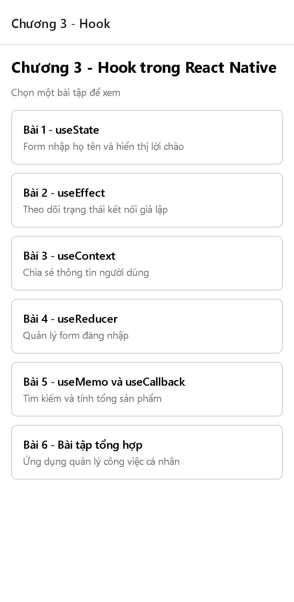
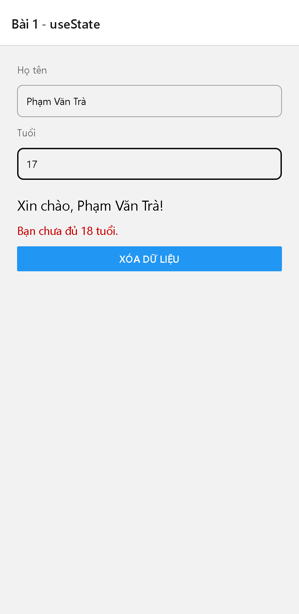
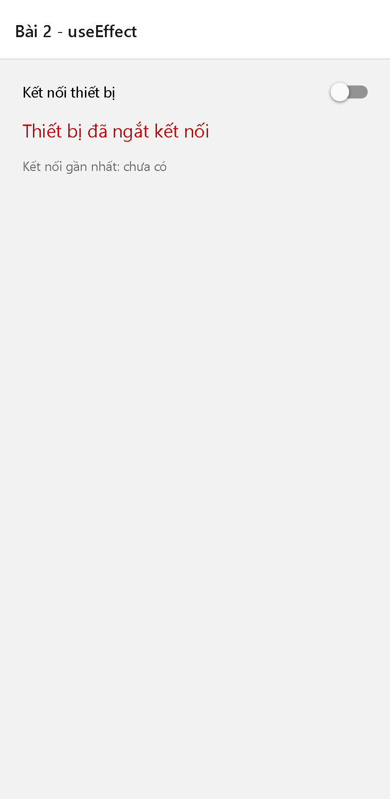
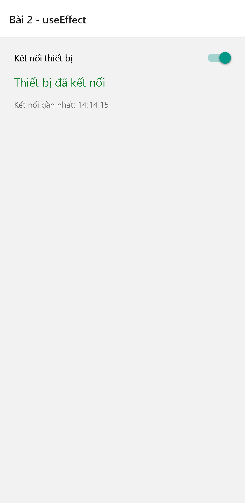
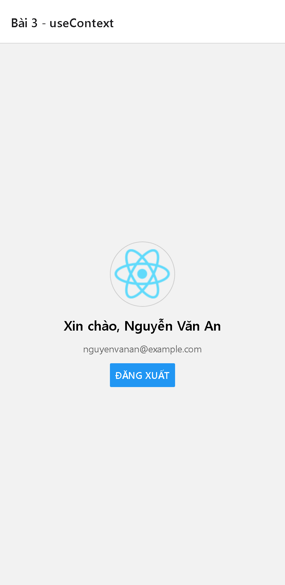
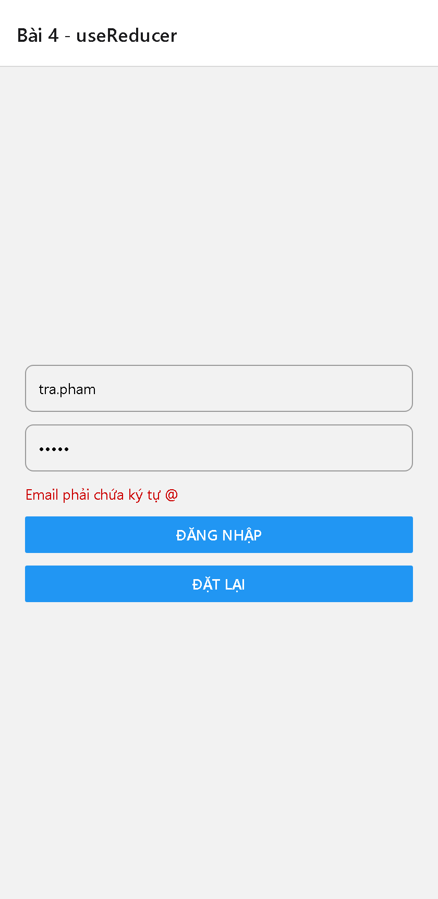
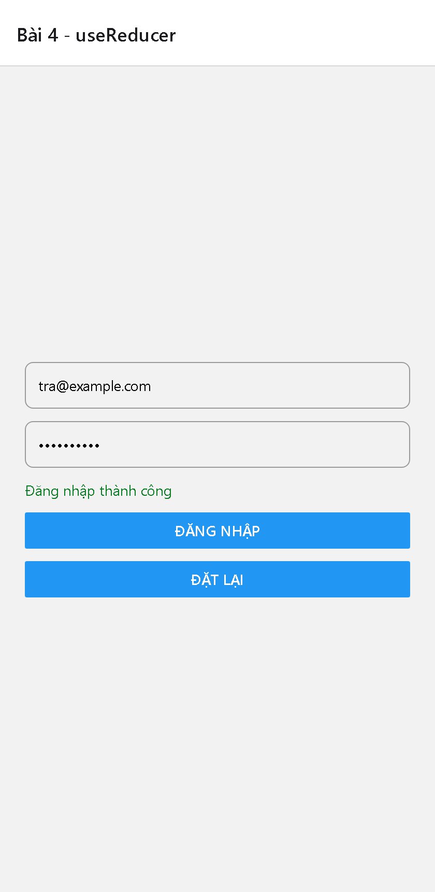

# Tuần 03 — Chương 3: Hook trong React Native

Sinh viên: **Phạm Văn Trà** — MSSV: **23633471**

Ứng dụng Expo Router gồm 6 màn hình, mỗi màn hình là một bài thực hành trong phiếu bài tập Chương 3.

## Cách chạy

```bash
npm install
npm start          # chọn nền tảng trong terminal
npm run web        # hoặc mở trực tiếp trên web
npm run typecheck  # kiểm tra TypeScript
```

## Màn hình danh sách bài tập



## Bài 1 — useState: Form nhập họ tên

Nhập họ tên để hiển thị lời chào, thêm trạng thái tuổi (cảnh báo khi dưới 18) và nút xóa toàn bộ dữ liệu.



## Bài 2 — useEffect: Theo dõi trạng thái kết nối

Công tắc kết nối giả lập, effect chạy lại theo `isConnected` để đổi thông báo, đổi màu chữ và ghi lại thời điểm kết nối gần nhất.

| Ngắt kết nối | Đã kết nối |
| --- | --- |
|  |  |

## Bài 3 — useContext: Chia sẻ thông tin người dùng

`UserContext` tách sang tệp riêng, cung cấp tên, email, ảnh đại diện và hàm đăng nhập/đăng xuất cho `ProfileScreen` mà không truyền props.



## Bài 4 — useReducer: Form đăng nhập

Một reducer quản lý email, mật khẩu, lỗi và trạng thái `isSubmitting`; kiểm tra email có `@`, mật khẩu tối thiểu sáu ký tự và có nút đặt lại.

| Báo lỗi | Đăng nhập thành công |
| --- | --- |
|  |  |

